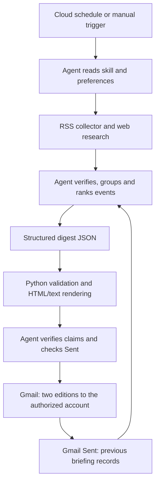

# AI News Briefing

Two daily AI news emails for people who build solutions and explain them to customers.

## What it does

The agent researches recent AI announcements and engineering developments, groups reports about the same event, and selects up to eight worthwhile stories. It writes a technical edition and a plain-English edition from that same selection. Python helpers collect RSS feeds and render the emails; a connected Gmail tool handles delivery.

## Architecture



- `SKILL.md`: the agent's research, editorial, recovery, and delivery instructions.
- `references/`: configurable sources, equal technical/customer relevance scoring, and data format.
- `scripts/briefing.py`: deterministic parsing and rendering. Deterministic means the same input produces the same output; it does not make AI decisions.
- Gmail Sent: a durable record of delivered events, accessible even if a cloud container is replaced.
- Cloud scheduler: starts the agent daily at 8 p.m. in the configured timezone. The package itself cannot create this service.

## Stack

| Layer | Technology | Why it is here |
| --- | --- | --- |
| Research and writing | Host cloud agent and web tools | Judge significance, verify claims, and adapt the explanation |
| Collection and rendering | Python 3.11+ standard library | No pip dependencies or paid API keys required |
| Input feeds | Public RSS/Atom plus web search | Broad coverage with visible failure reports |
| Delivery/history | Connected Gmail tools | Send both editions and inspect only this workflow's sent history |
| Distribution | GitHub skill/plugin package | Reusable instructions and code, without personal credentials |

## Running it

From the repository root after cloning or downloading:

```sh
python3 -m unittest discover -s tests -v
python3 skills/daily-briefing/scripts/briefing.py render --input examples/digest.json --out runs/preview
python3 skills/daily-briefing/scripts/briefing.py collect --hours 30 --out runs/candidates.json
```

The example is explicitly fictional. Rendering never sends email. Collection needs network access and yields candidates that still require editorial review.

Validation on September 29, 2026: 14 behavioral tests passed; fictional editions rendered; a live collection returned 79 candidates with all 10 configured feeds succeeding. Plugin and skill format validation also passed. Tests and rendering also passed from a clean local clone. One configured cloud instance delivered both editions on September 29 at 20:00 Pacific using official-page/search fallback after all feed retrievals failed. It composed the messages directly; the Python helper was not run in that cloud instance. New installations must still verify cloud scheduling and unattended delivery separately using [CLOUD_SETUP.md](docs/CLOUD_SETUP.md); local tests do not establish either capability.

## Decisions and tradeoffs

| Decision | Chosen | Alternative | Why / tradeoff |
| --- | --- | --- | --- |
| Execution | Existing cloud agent allowance | Separate hosted app and billed AI API | Avoids adding services; depends on cloud tools and plan limits |
| Audience | Two editions, one shared event list | One mixed email | Easier to read and share, with extra writing and delivery work |
| Relevance | Equal technical and customer-facing SE weights | Pure model-release tracking | Includes implementation lessons and customer implications |
| X discovery | Public search and corroborating announcements | Paid X API or scraping service | No added charge, but incomplete post coverage |
| History | Coverage records in Sent | Database | No additional hosting; cannot atomically prevent concurrent sends |
| Sharing | Generic config, no recipient or credentials | Personal configuration in code | Others use their own connections and explicitly authorize delivery |

Semantic deduplication means recognizing that several different headlines describe one event. The agent does this; URL cleanup only removes obvious tracking duplicates. Both editions retain the same event identifiers, and later runs can distinguish a genuinely new update from another article about yesterday's announcement.
